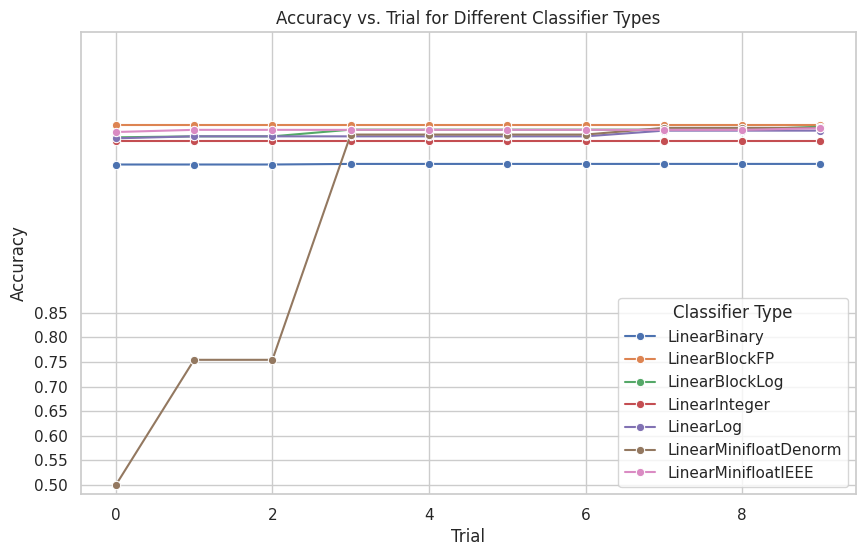

# Lab1

## Task 1

The image below shows the comparison of PTQ and QAT across different fixed point width ranging from 4 to 32. The frac_width is half of the width, which ensures stability, avoids precision loss, and provides a balanced representation for fixed-point calculations.

```
"config": {
                "name": "integer",
                # data
                "data_in_width": width,
                "data_in_frac_width": width // 2,
                # weight
                "weight_width": width,
                "weight_frac_width": width // 2,
                # bias
                "bias_width": width,
                "bias_frac_width": width // 2,
            }
```


It can be observed that

1. **Significant Difference Between PTQ and QAT at Lower Fixed Point Widths**:
   * When the fixed point width is small (e.g., 4-8 bits), QAT (Quantization-Aware Training) significantly outperforms PTQ (Post-Training Quantization) in accuracy.
   * At 4-bit, QAT achieves around 0.84 accuracy, whereas PTQ lags behind at approximately 0.65, indicating that QAT adapts better to low-bit quantization.
2. **Accuracy Converges as Fixed Point Width Increases**:
   * Beyond approximately 10 bits, both PTQ and QAT achieve similar accuracy, stabilizing around 0.85.
   * This suggests that as precision increases, the impact of quantization techniques diminishes.
3. **QAT is More Stable at Lower Bit Widths**:
   * QAT reaches near-optimal accuracy (\~0.84) at just 6-bit, whereas PTQ requires at least 10-bit to achieve a similar performance.
   * This indicates that QAT preserves model accuracy better at lower bit widths, while PTQ needs higher precision to match QAT's performance.
4. **QAT is a Better Choice for Resource-Constrained Environments**:
   * If the goal is to run a model with lower bit widths (e.g., 6-8 bits), QAT is likely the superior approach as it maintains higher accuracy at lower precision.

## Task 2

The image below shows the impact of different sparsity and different pruning methods on model accuracy. The number of epoch is set to be 5.


It can be observed that

1. Increased Sparsity can Lead to Decrease of the Model Accuracy
2. **L1-Norm Pruning Outperforms Random Pruning**👍

   * Even at high sparsity levels (above 0.7), L1-Norm pruning still achieves better accuracy compared to random pruning, indicating that it preserves model effectiveness more efficiently.
3. **Random Pruning Has a More Severe Impact on Model Performance**:

   * As sparsity increases, the accuracy of models using random pruning drops sharply, especially after 0.5, where it declines to below 0.6.
   * At 0.7 and beyond, the accuracy nearly collapses to around 0.5, suggesting that random pruning may remove critical weights and significantly degrade model performance.
4. **Pruning Strategy Has a Significant Impact on Model Performance**:

   * If the goal is to increase sparsity (to reduce computational cost), L1-Norm pruning is clearly the better choice.
   * Random pruning may work at low sparsity levels, but its impact becomes detrimental as sparsity increases.

# Lab 2

## Task 1

According to the definition of the Grid sampler, it traverses all the possible options in the search space. To save the time of training, the search space is defined as follows:

```
search_space = {
    "num_layers": [2, 4],
    "num_heads": [2, 4],
    "hidden_size": [128, 192],
    "intermediate_size": [512, 768],
    "linear_layer_type": ["linear", "identity"],
}
```

It must be noted that the reason why to define the search space like this is to save the training time and compare the performance of the 2 samplers. The opimial solution found in the search space may not be the most optimal one compared to other more complex search spaces. The definition of the search space will be explored later. And the number of epoch is set to be 1 currently, which will also be explored later.

According to the search space, the number of trials for the Grid sampler is 32. To ensure the fairness of the comparison, the number of trials for the TPESampler is also set to be 32. The comparision between the Grid Sampler and the TPESampler is shown in the figure below:


It can be observed that:

1. **GridSampler Finds the Optimal Solution Faster**:
   * Within the first two trials, GridSampler quickly reaches an accuracy of around 0.85 and remains stable in subsequent trials.
   * In contrast, TPESampler takes about seven trials to reach the same optimal accuracy.
2. **TPESampler Starts Slower but Eventually Matches GridSampler**:
   * In the initial trials, TPESampler achieves lower accuracy (around 0.81 - 0.82).
   * However, after seven trials, it successfully finds the optimal hyperparameters, reaching 0.85 accuracy and stabilizing.
3. **Both Methods Eventually Reach the Same Best Accuracy**:
   * After more than ten trials, both GridSampler and TPESampler stabilize at around 0.85 accuracy.
4. **GridSampler is Better for Quick Optimization, While TPESampler is More Suitable for Global Search**:
   * GridSampler is effective for small search spaces, as it quickly explores all possible parameter combinations.
   * TPESampler, which uses Bayesian optimization, starts slower but is better suited for large search spaces, potentially finding better solutions in complex scenarios.

### Search Space Exploration

To explore the impact of different search space choices,  some box plots are shown below. It can be observed that

* **The most critical hyperparameter is `linear_layer_type`**, where choosing `"linear"` significantly improves accuracy.
* Increase the **`hidden_size` and `intermediate_size` can also provide a slight performance boost**, but the impact is not as strong as the linear layer type.


### Number of Training Epoch Exploration

To explore the effect of number of epoch and save the time of training, the other parameters are fixed and set as follows:

```params
params = {
    "num_layers": 2,
    "num_heads": 2,
    "hidden_size": 128,
    "intermediate_size": 512,
    "linear_layer_type": "linear"
}
```

Different number of training epoches are tried, ranging from 1 to 4. The results are listed in the figure below. It can be observed that increasing the number of epochs can increase the accuracy. However, the improvement is not obvious after 3 epochs.


## Task 2

### Experiment Set Up

TPESampler is chosen as the search sampler. The search space is the same as in Task 1. To save the training time, the number of trials is set to be 10, which can definitely be used by TPESampler to find the optimal parameters according to the results in Task 1. And the number of epoch is set to be 1, although more epoch can increase the accuracy.

### Results

The comparison of NAS performance of different strategies is shown below.


It can be observed that

1. **Compression With Post-Training Outperforms No Compression**

   * The green line (`Compression With Post-Training`) starts at a similar accuracy as `No Compression` but gradually increases and stabilizes at a higher accuracy (\~0.865). This suggests that applying compression followed by post-training can **enhance model accuracy beyond the uncompressed baseline**.
   * The reason is Compression removes redundancy and prevents overfitting, helping the model generalize better. Post-training fine-tunes the remaining parameters, allowing the model to recover lost accuracy.
2. **No Compression Maintains a Stable Accuracy**

   * The blue line (`No Compression`) remains constant at around **0.85 accuracy** throughout all trials.
   * This indicates that without compression, the model maintains a steady performance without any significant improvement.
3. **Compression Without Post-Training Hurts Performance**

   * The orange line (`Compression No Post-Training`) remains significantly lower (\~0.82 accuracy) and does not improve over trials.
   * This suggests that compression alone **reduces model accuracy**, likely due to information loss, and without fine-tuning, the model cannot recover its performance.

# Lab 3

## Task 1

### Experiment Set Up

TPESampler is chosen as the search sampler. To save the training time, the number of trials is set to be 30. For large search spaces, increase the number of trials can obtain better results. And the number of epoch is set to be 1, although more epoch can increase the accuracy.

### Results

The search performance is shown in the figure below. It can be observed that as the number of trials increases, the sampler tend to find more optimal parameters for each layer.


## Task 2

### Experiment Set Up

To compare the performance of different precisions such as Minifloat, BlockFP, BlockLog, Binary, etc, one experiment is run for each precision.  In detail, each precision has a search space according to its configuration. For example, `LinearMinifloatDenorm` has the following search space:

```
kwargs["config"] = {
                    "data_in_width": trial.suggest_categorical("data_in_width", [4, 8, 16]),
                    "data_in_exponent_width": trial.suggest_categorical("data_in_exponent_width", [4, 5, 6]),
                    "data_in_exponent_bias": trial.suggest_categorical("data_in_exponent_bias", [13, 15, 17]),
                    "weight_width": trial.suggest_categorical("weight_width", [4, 8, 16]),
                    "weight_exponent_width": trial.suggest_categorical("weight_exponent_width", [4, 5, 6]),
                    "weight_exponent_bias": trial.suggest_categorical("weight_exponent_bias", [13, 15, 17]),
                    "bias_width": trial.suggest_categorical("bias_width", [4, 8, 16]),
                    "bias_exponent_width": trial.suggest_categorical("bias_exponent_width", [4, 5, 6]),
                    "bias_exponent_bias": trial.suggest_categorical("bias_exponent_bias", [13, 15, 17]),
                }
```

TPESampler is chosen as the search sampler. To save the training time, the number of trials is set to be 10. For large search spaces, increase the number of trials can obtain better results. And the number of epoch is set to be 1, although more epoch can increase the accuracy.

### Results

The curve for different precisions is shown in the figure below:



It can be observed that

* **Most precisions** (e.g., `LinearBlockFP`, `LinearBlockLog`, `LinearInteger`, `LinearLog`, `LinearMinifloatIEEE`) have similar high accuracies around **0.86-0.88**. Particularly, `LinearBlockFP` has better results while`LinearInteger`has worse results.
* `LinearBinary`  has a **significantly lower accuracy** compared to the others, maintaining a stable lower value across trials.
* **`LinearMinifloatDenorm` starts with low accuracy (\~0.5)** and gradually improves over trials, eventually reaching around **0.85**.

# Lab 4

## Task 1

When the device is CPU and n is set to be 50 instead of 5, the run-time of the original model is `2.4823 s` and the optimized model is `2.0871 s` , which means the optimized model is faster.

The reason can be as follows:

* When using `torch.compile(model)`, the first time the model runs, it needs to **convert the PyTorch model into an optimized form**. This process includes tracing, graph optimization, and code generation, which takes extra time. This is called **compilation overhead**.
* If `n` is small (e.g., `n=5`), the time spent compiling the model is large compared to the time saved by optimization, making the optimized model slower. However, when `n` is larger (e.g., `n=50`), the initial compilation cost is spread over many runs, so the optimized model becomes faster.

However, when the device is GPU, the problem doesn't exist. When n is 5, the run-time of the original model is `0.0973 s` and the optimized model is `0.0491 s`, which is faster than the original model. Moreover, both of the models are faster than CPU. This is because `torch.compile()`**fuses operations, reduces kernel launches, optimizes memory usage, and takes advantage of specialized GPU hardware** (like Tensor Cores). These optimizations are much more effective on GPUs than CPUs, where the gains are often smaller.

## Task 2

The results are shown in the table below:


| Device | Model Type | Time (s) |
| ------ | ---------- | -------- |
| CPU    | Naive      | 0.6486   |
| CPU    | Fused      | 0.0248   |
| GPU    | Naive      | 0.0020   |
| GPU    | Fused      | 0.0003   |

It can be observed that

* **Fusion dramatically improves performance on both CPU and GPU**.
* **Fusion benefits CPU more (relative speed-up), but GPUs remain much faster overall**.

## Task 3

### Q (a)

1. **Increased Computational Efficiency**

* Integer operations are significantly faster and more energy-efficient than floating-point (e.g., FP16 or FP32) operations. And it can provide higher throughput compared to FP16/FP32 execution and reduce data transfer overhead.

2. **Lower Memory Bandwidth Requirements**

* Quantizing both **activations** and **weights** from FP32 to INT8 reduces memory footprint by 4×, allowing more data to fit in on-chip SRAM or cache. This reduces expensive DRAM access, leading to **lower latency** and higher energy efficiency.

3. **Maintaining Model Accuracy**

* MXINT8 can dynamically adjust **scaling factors** to ensure numerical stability while still leveraging INT8 execution.

4. **Hardware Parallelism & Specialized Compute Units**

* Custom hardware may include **specialized matrix multiplication units** optimized for MXINT8 operations.
* These units can perform **low-precision tensor computations in parallel**, significantly increasing throughput for **linear layers, convolutions, and transformers**.

### Q (b)

The purpose of `dont_need_abs` is to determine whether bias correction is needed when converting from MXINT8 (6-bit mantissa) and BF16 (7-bit mantissa). This helps align the mantissa precision between them.

It checks **bit 7** of `mantissa_abs` (`0x40 = 0b01000000`):

* If **bit 7 is 1**, `dont_need_abs = true`, meaning **no bias correction is required**.
* If **bit 7 is 0**, `dont_need_abs = false`, meaning **bias correction is necessary**.

The purpose of `bias` is to compensate for quantization errors. It stores the closest BF16 value with only the sign and exponent and sets the fraction to zero. This ensures that the BF16 number is correctly aligned with the MXINT8 representation.

### Q (c)

#### cta_tiler

In `dequantize1d_device`, `cta_tiler` partiate the data using `local_tile`, which splits a tensor into tiles using a tiler and extracts a specific part of the tile using a coordinate. The implementation details are in the function `inner_partition`:

1. Tiling the Tensor

   `auto tensor_tiled = zipped_divide(static_cast<Tensor&&>(tensor), tiler);` It splits tensor into 2 sets of modes: ((Tile_Dims), (Rest_Dims)).

   * `Tile_Dims` represent the **larger tile-level dimensions**, e.g., `(BLK_A, BLK_B, ...)`.
   * `Rest_Dims` represent the **inner dimensions within each tile**, e.g., `(a, b, ..., x, y)`.
2. Getting the Tile Rank

   `constexpr int R0 = decltype(rank<0>(tensor_tiled))::value;` This retrieves the **rank (number of dimensions) of the first mode (Tile mode)**.
3. Indexing the Rest Mode

   * If the `coord` is a tuple, flatten the first mode (Tile mode) to ensure all tiles remain selected and ensure that `coord` aligns correctly with `Rest_Dims`.
   * Else, directly indexes into `Rest_Dims`.

#### layout_tx

`layout_tX` uses  `local_partition` to partition the threads for computation.

Thread Distribution Logic:

* If `cta_tiler = (BLK_M, BLK_K)`, the thread block processes a `BLK_M × BLK_K` tile of data.
* If `layout_sX = (thd_m, thd_k)`, each thread handles a `thd_m × thd_k` chunk of data.
* Each thread's data access is computed based on `layout_sX`

For example,

Assume:

* `cta_tiler = (8, 8)`, meaning each thread block processes an `8×8` tile.
* `layout_sX = (4, 2)`, meaning each thread processes a `4×2` chunk.
* `threadIdx.x = 0, 1, 2, ..., 31` (assuming 32 threads in a block).

Then:

* `layout_sX`**divides `sX (8,8)` into smaller `(4,2)` blocks**.
* Each thread accesses a distinct `(4,2)` portion of `sX`, enabling parallel processing.

### Q (d)


1. **Memory Overhead from MXINT8 Format**

The compression assumption is based on **only storing weights**, but in practice:

* **Additional memory is needed for scale factors and offsets.**
* **Group quantization metadata** (e.g., `group_size = 32`) adds extra storage.
* **Dequantization buffers** and **workspace memory** for computation also consume memory.


2. **Activation & Intermediate Memory Usage**

* While weights are quantized, activations **remain in FP16 or BF16** for inference efficiency.
* **Intermediate tensors (hidden states, attention buffers, etc.) are still stored in FP16/FP32.**
* Temporary tensors for dequantization (e.g., scaling factors) occupy memory


3. **CUDA Kernel and Memory Fragmentation**

* **Memory fragmentation** occurs when converting FP32 `torch.nn.Linear` to `QLinearPacked`.
* **CUDA kernel execution may introduce additional memory buffers** for fused operations.
* **Tensor alignment** in CUDA memory management leads to extra padding.


4. **Model Components Not Quantized**

* **Only `torch.nn.Linear` layers are quantized**, **but classifier layers remain FP32.**
* **Embedding layers, layer norms, biases, and attention layers** still use **FP32/FP16**.
* **Optimizer states (if training mode is enabled) also contribute to memory usage.**
